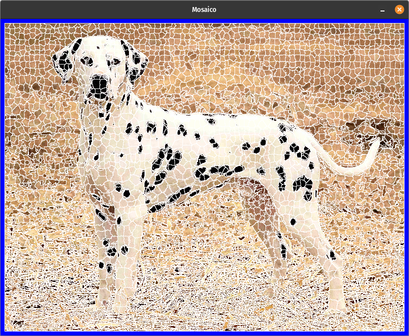

# SLIC C/C++ implementation

### Dependencies:

`libopencv-dev`

### Build instructions:

`make init`

`make`

### Run:

`./slic Dalmata.png -S`

Original author [arturoemx](https://github.com/arturoemx)
